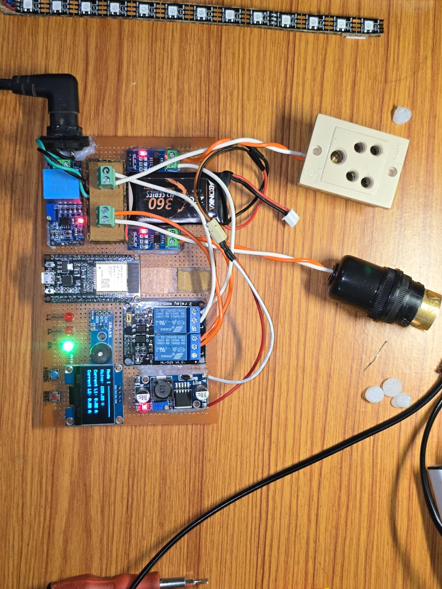
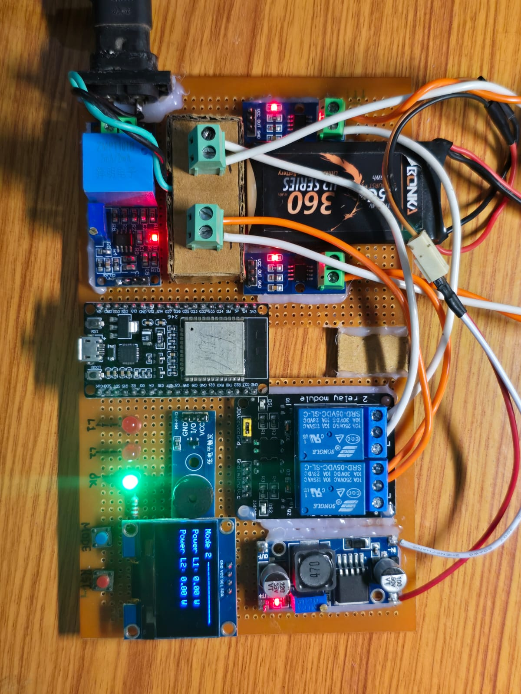
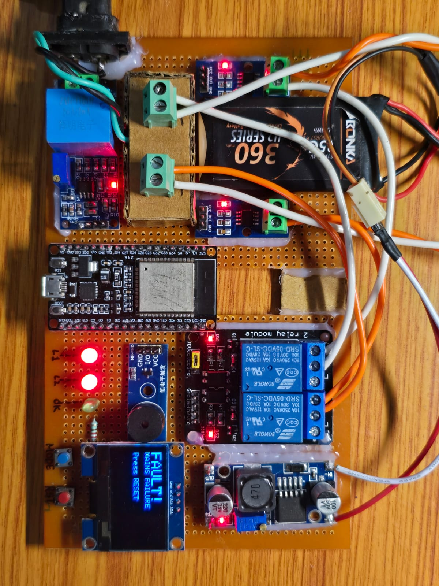

# ESP32-Smart-Energy-Management-System

A real-time, RTOS-driven energy management node designed to monitor domestic power consumption, execute high-speed fault protection, and provide asynchronous telemetry via MQTT. 

This system utilizes an asymmetric multiprocessing architecture on the ESP32, strictly isolating the network stack from critical True-RMS DSP and hardware-level safety interlock routines to guarantee deterministic performance.

## System Architecture

* **Core 0 (Network Stack):** Dedicated to handling Wi-Fi connectivity, MQTT payload serialization, and asynchronous state publishing. Engineered with static C-string buffers (`snprintf`, `strcmp`) to prevent heap fragmentation during long-term continuous operation.
* **Core 1 (Real-Time Control):** Dedicated to high-frequency ADC polling, DSP algorithms for True-RMS calculation, and hard-real-time safety checks.
* **Safety Interlocks:** Features independent Over-Current (OC) latching for dual load channels and a global Over-Voltage/Under-Voltage (OV/UV) mains trip. These execute completely outside the network loop for immediate load disconnection.

## Hardware Stack

* **Microcontroller:** ESP32 (Tensilica Xtensa Dual-Core)
* **Voltage Sensing:** ZMPT101B (Galvanically isolated)
* **Current Sensing:** 2x ACS712 (Hall-effect, Dual Channel)
* **HMI Display:** SH1106 128x64 OLED (I2C)
* **Actuation:** Dual 5V Relays for load switching
* **Alerts:** Active Buzzer and discrete LED fault indicators

### Hardware Implementation & Demo
The final circuit is securely implemented on a custom hand-soldered zero PCB perf board for optimal signal integrity in noisy environments.

#### System Demonstration
<video src="media/Video.mp4" controls width="100%" max-width="600px"></video>

#### Hardware Setup Gallery

## Firmware Features

* **FreeRTOS Integration:** Task scheduling and strict core pinning for deterministic execution.
* **Custom DSP Algorithm:** Lightweight True-RMS processing of AC waveforms (V, I1, I2) with software-based auto-calibration for sensor offset nulling on boot.
* **Memory Safety:** Strict avoidance of dynamic memory allocation (e.g., Arduino `String` class) in MQTT callbacks to ensure industrial-grade uptime.
* **Energy Analytics:** Continuous calculation and smoothing of active power (W) and accumulated energy consumption (kWh).

## 🔌 Pin Mapping

| Component | GPIO Pin | Type | Notes |
| :--- | :---: | :---: | :--- |
| **ZMPT101B (Voltage)** | `34` | Analog IN | True-RMS Sampled |
| **ACS712 (Load 1 Current)** | `32` | Analog IN | True-RMS Sampled |
| **ACS712 (Load 2 Current)** | `33` | Analog IN | True-RMS Sampled |
| **Relay 1 (Load 1)** | `26` | Digital OUT | Active High |
| **Relay 2 (Load 2)** | `25` | Digital OUT | Active High |
| **System OK LED** | `14` | Digital OUT | Green |
| **Fault L1 LED** | `27` | Digital OUT | Red |
| **Fault L2 LED** | `23` | Digital OUT | Red |
| **Alert Buzzer** | `18` | Digital OUT | PWM Tones |
| **Reset Button** | `13` | Digital IN | Internal Pullup |
| **Mode Button** | `19` | Digital IN | Internal Pullup |
| **SH1106 OLED (SDA)** | `21` | I2C | Hardware I2C |
| **SH1106 OLED (SCL)** | `22` | I2C | Hardware I2C |

## Setup and Deployment

1. Configure the MQTT Broker IP and Wi-Fi credentials in `src/main.cpp`.
2. Open the project folder in VS Code with the **PlatformIO** extension active.
3. Compile and flash the firmware using the PlatformIO toolbar. The environment automatically fetches `PubSubClient`, `Adafruit GFX`, and `Adafruit SH110X` dynamically as defined in `platformio.ini`.
4. **Calibration Sequence:** Upon boot, the system holds at the splash screen to run `calibrateACS()`, sampling the baseline noise floor of the Hall-effect sensors to calculate precise offsets for accurate zero-crossing detection.

---
**Developed by:** Deepjyoti Dutta  
*B.Tech Electronics and Telecommunication Engineering, Assam Engineering College*  
Designed to demonstrate core embedded systems proficiency, integrating principles of digital signal processing, real-time operating systems, and hardware design relevant to industrial applications.